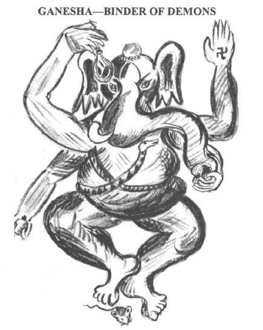
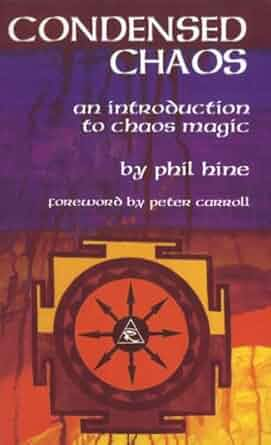

# 🐘ガネーシャ・デーモン・モーフィング　（Fil Hine方式）

### ⚖️この文書について

本書に収録した「ガネーシャ・デーモン・モーフィング」のエクササイズは、フィル・ハイン著『Condensed Chaos』（1995年版、Phil Hine、p.166–167）に掲載された内容に基づいている。
原著の精神を尊重しつつ、日本語訳＋注解を付した形で再構成・公開している。
この公開は、オープンソース魔術（Open Source Witchcraft）の理念に則り、非営利・教育的目的で行われる。

 
This page is maintained by ravensgate (KSC) a.k.a. Le Sorcier Inconnu.</vr> 
著者のKSCこと「知られざる呪術師」は ドロレス・アッシュクロフト=ノーウィッキから直接第３位界のイニシエーションを受け ダイアン・フォーチュンから続く法脈を受け継いでいる。

---

## GANESHA 

  

画像参照：Phil Hine著『Condensed Chaos』（1995年版, p.166–167）

---

## 🇯🇵ガネーシャ・デーモン・モーフィング

>楽な姿勢で自分に合ったリラクゼーションを行なって、身体感覚に意識を向けます。目を閉じて、意識を腹部へと向けましょう。その部位が赤い霧に満たされた虚空であるかのように感じながら、呼吸を繰り返してください。息を吸い、吐くたびに、象の頭を持つガネーシャの姿がお腹の中で形作られていくのをイメージしましょう。心の中で「オーム・ガン・ガナパタイェー・ナマハー」のマントラを唱え続けます。ガネーシャの姿が体内に形成されたら、今度は自分自身がガネーシャの姿に変わっていく様子を想像してください。鼻が伸びて鼻先が長い鼻（トランク）となり、耳は象のような大きなものに変わっていきます。身体の輪郭が変化していく感覚を感じましょう。この変容が完了したら、再び内側へと意識を向けます。そして、自分の中にネガティブな「デーモン的な反応」を引き起こす状況を視覚化します。その状況がお腹の中で展開され、自分自身もそこにいるとイメージしてください。身体感覚には意識を向け続けますが、浮かんでくる思考や自己認識には同一化しないようにします。ゆっくりと深い呼吸をして、身体感覚をただ純粋に感じ取るように意識しましょう。でもその感覚には、レッテルを貼ったり解釈を加えないようにしましょう。
>
>やがて、その身体感覚が心地よいものに変わっていくのを感じましょう。喜びが次第に広がり、リラックスできる感覚と変化します。この感覚を力の源として捉え、その力が身体の中に蓄積されていくのを感じてください。力が十分に満ちたら、自然に声を上げたくなる衝動が湧き起こります。そこから出た音を繰り返してください。言葉やマントラが自然に形作られるかもしれません──その場合は、それを心の中にしっかりと保ちましょう。ここで、いわゆる「エレファント・ダンス」（象が水場で頭を左右に振る習性に由来する）を始めます。首の筋肉を緩め、頭を左右に揺らしながら、胴体も左右に揺らします。この動作でリラックスすることにより、カタルシスで生じた余分な緊張が体に残るのを防ぎます。
>
>このエクササイズは、デーモンワークにおいて2つの利点があります。すでに過ぎてしまった出来事に対しても続くことがある、自動的に反応するネガティブな対応から自分を解放すること。勝手に反応してしまいそうなデーモンの思考・感情・行動パターンに気づいて、飲み込まれないようにします。つまり、デーモン的な自動反応が悪循環して、ループになるのを防ぎます。
>
>このワークでは、ガネーシャが「遊び心に満ちた神」であることが非常に役立ちます。エゴに関する魔術は、「真面目すぎる決意」よりも「遊び心のあるリラックス状態」でアプローチする方が、はるかに効果的だからです。

---

## 🇬🇧 GANESHA DEMON-MORPHING

>Place yourself in a comfortable position, perform any preferred relaxation exercise, and give attention to your bodily sensations. Close your eyes and turn your mind inwards, towards your belly. Feel that part of your body to be a void, filled with red mist. As you breathe in and out, imagine the form of elephant-headed Ganesha taking shape within your belly. Repeat internally the mantra "Om Ganapati Namah."
>
>Once Ganesha has formed inside you, imagine that you are becoming yourself an image of Ganesha—your nose lengthens to become a trunk, your ears become those of an elephant—feel your body outline changing. When this metamorphosis is complete, turn your attention once again inwards, and then visualise a situation which stirs the evocation of a demon within yourself. See the situation occurring within your belly and see yourself there in it. Be aware of body sensations, but still any thoughts and identifications that arise. Let your breathing become slow and deep, and be aware of how your body feels as pure sensation, without an identification or label.
>
>Slowly, feel that physical sensation to be one of pleasure—a growing sense of joyfulness which you can relax into. Feel that sensation as a source of power, and allow that power to build up inside you until, finally, you have to give voice to it. Repeat the sound that issues from you. A word or mantra may form. If it does, keep hold of it in your mind. At this point, begin the so-called 'Elephant Dance' which is named from the habit of elephants moving their heads from side to side at a watering-hole. Allow your head to loll from side to side, keeping your neck-muscles loose, and move your torso left and right. This movement prevents residual tension settling into the body following the catharsis of the above exercise.
>
>This exercise is useful for Demon work in two ways. Firstly, you can use it to free yourself from the grip of a demonic response that continues long after the initial trigger-event has passed. Secondly, by mentally projecting a situation where a demon might arise, you are learning to identify the characteristic thoughts, feelings, and behavior appropriate to that demon, and so become aware of when you are allowing its responses to carry you away. Once you know the points of the feedback loops, it is easier to break out of them.
>
>It is useful, for this kind of work, that Ganesha is very much a Playful God as it seems to be most effective to approach most kinds of Ego magic from a condition of Playful Relaxation than Grim Determination.

---

### 🐌 「知られざる呪術師」による注釈

デーモンについて：
本書における「デーモン」とは、キリスト教的な「悪魔」を指すのではなく、個人の無意識に潜在する生の感情エネルギーや行動パターンを象徴する存在である。古代ギリシア思想において「ダイモーン（Daemon）」は、善悪を超えた中間存在、あるいは個人に付随する守護的エネルギーを意味する。本文ではこのニュアンスに則り、「デーモン」という表記を採用している。

デーモン・ワークの心得：
デーモン・ワークとは、内的な生のエネルギー──怒り、恐怖、欲望、悲しみといった感情反応を抑圧するのではなく、意識的に認識し、統合する作業を指す。デーモンは敵ではなく、気づきと変容のための教師である。魔術的な自己鍛錬においては、これらの原始的パターンを恐れることなく受け止め、自己の力として昇華する姿勢が求められる。

---

### 🧙‍♂️フィル・ハインについて

フィル・ハイン（Phil Hine）は、イギリス出身の現代魔術研究家・実践者であり、特にケイオスマジックの発展に大きな影響を与えた人物である。
著書『Condensed Chaos』『Prime Chaos』などを通じて、魔術を実用的かつ柔軟な技法体系として再構成し、個人探究と自由な実践を重視する姿勢を提唱している。
彼の活動は、伝統的魔術体系に依存しないオープンな精神を特徴としており、現代の意識探究型シャーマニズムや個人鍛錬型の魔術観に大きな影響を与え続けている。

---

### 🖼️ 画像についての注記

  

 

Amazon.co.jp ⏩ [Condensed Chaos: An Introduction to Chaos Magic / Phil Hine (著), Peter J. Carroll (はしがき)](https://www.amazon.co.jp/Condensed-Chaos-Introduction-Occult-Studies/dp/1935150669)

- 上図の「GANESHA—BINDER OF DEMONS」は、Phil Hine著『Condensed Chaos』（1995年版, p.166–167）に収録された挿絵です。著作権は原著者に帰属します。本Zineでは教育目的かつ非営利の「フェアユース／引用」の範囲内で掲載しています。

- 表紙画像（上図）は同書のカバーデザインの一部を示したものであり、出典は以下のとおりです。
出典：Phil Hine, Condensed Chaos: An Introduction to Chaos Magic, 1995, New Falcon Publications.

---

こちらもご覧ください➡️[ディスコーディアン魔術アーカイブ](https://github.com/ravensgate-tux/Discordianism_ksc/blob/main/README.md)

---
© 2025 知られざる呪術師（Le Sorcier Inconnu）  
本ドキュメントは [Creative Commons BY-SA 4.0](https://creativecommons.org/licenses/by-sa/4.0/deed.ja) に基づき公開されています。

